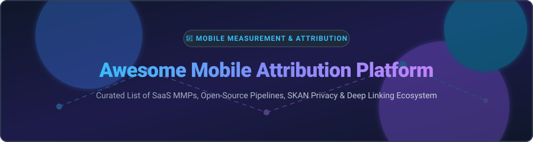

# Awesome Mobile Attribution Platform 📱🚀

  
  
  
  
  
  

---

## 📌 Top Mobile Attribution Platform Ecosystem

> **Curated List of Commercial SaaS Products & Open-Source GitHub Projects**  
> *Focused on Mobile Measurement Partners (MMP), Install & In-App Event Attribution, Deferred Deep Linking, Ad Fraud Prevention, SKAdNetwork (SKAN 4.0), Apple ATT & Privacy-Centric App Analytics*

---

## 📚 Table of Contents

- [📊 Sector Overview & Market Dynamics](#-sector-overview--market-dynamics)
- [🏢 SaaS & Commercial MMP Platforms](#-saas--commercial-mmp-platforms)
- [🔓 Open-Source GitHub Projects](#-open-source-github-projects)
- [🤝 How to Contribute](#-how-to-contribute)
- [⚠️ Disclaimer](#%EF%B8%8F-disclaimer)
- [📈 Star History](#-star-history)
- [💖 Support & Community](#-support--community)

---

## 📊 Sector Overview & Market Dynamics

> 💡 **Market Size & Structure**: The global **Mobile Measurement Partner (MMP) & Mobile Attribution Market** is estimated at **$3.8 Billion – $5.2 Billion USD** (growing at a ~13.5% CAGR). The market structure is **highly concentrated** (a winner-take-most environment), heavily dominated by established commercial MMPs (Adobe, Branch, AppsFlyer, Adjust, Singular) due to extensive SDK partner networks (Meta, Google, TikTok, Apple Search Ads), specialized ad fraud prevention suites, and complex privacy compliance frameworks (Apple SKAdNetwork/ATT & Google Privacy Sandbox).

---

## 🏢 SaaS & Commercial MMP Platforms

Commercial MMPs aggregate ad spend, attribute app installs, provide deferred deep linking, and manage privacy-compliant SKAN reporting across ad networks.

*Sorted by **Company Size (Revenue / Valuation)** in descending order:*

| Product / SaaS | Company Size (Valuation / Revenue) | Starting Pricing Tier | Free Tier / Free Trial Limits | Key Features & Focus |
| :--- | :--- | :--- | :--- | :--- |
| **[Adobe Analytics / Attribution](https://business.adobe.com/)** | **~$240.0B Valuation** ($19.4B+ Revenue) | **$2,000 / month** (Select enterprise plan) | **30-day sandbox trial** with enterprise demo | Enterprise cross-channel multi-touch attribution, customer journey analytics & web-to-app tracking. |
| **[Branch](https://www.branch.io/)** | **~$4.0B Valuation** ($100M+ ARR) | **$59 / month** (Growth plan starting >10k MAU) | **Free Forever Tier** up to 10,000 MAU | Industry standard for deferred deep linking, web-to-app user routing & cross-platform install attribution. |
| **[AppsFlyer](https://www.appsflyer.com/)** | **~$2.0B Valuation** ($300M+ ARR) | **$0.06 per attribution** (Growth Plan) | **12,000 free attributions** total upon signup | Market leader in mobile attribution, Protect360 ad fraud defense, Data Clean Rooms & SKAN dashboards. |
| **[Adjust](https://www.adjust.com/)** | **~$1.0B Valuation** (Acquired by AppLovin) | **$120 / month** (Starter Plan) | **30-day free trial** up to 10,000 attributions | Privacy-focused mobile measurement, automated campaign automation, fraud prevention & mobile gaming SDKs. |
| **[Singular](https://www.singular.net/)** | **~$150M Valuation** ($35M+ ARR) | **$499 / month** (Growth Plan) | **30-day free trial** up to 100,000 conversions | Unified marketing analytics, automated cost aggregation (ROAS), SKAN analytics & attribution ETL. |
| **[Kochava](https://www.kochava.com/)** | **~$100M Valuation** ($25M+ ARR) | **$100 / month** (Standard Plan) | **Free Forever Tier** up to 10,000 conversions/mo | Real-time analytics, configurable attribution waterfall, subscription tracking & fraud blocklists. |
| **[Airbridge](https://www.airbridge.io/)** | **~$50M Valuation** ($12M+ ARR) | **$199 / month** (Starter Plan) | **14-day free trial** up to 50,000 attributions | Web-to-app attribution, incremental marketing lift modeling, SKAN dashboards & custom event routing. |
| **[Northbeam](https://www.northbeam.io/)** | **~$50M Valuation** ($12M+ ARR) | **$300 / month** (Starter Plan) | **14-day free trial** with spend sync | First-party data attribution, machine learning Media Mix Modeling (MMM) & e-commerce app analytics. |
| **[Rockerbox](https://www.rockerbox.com/)** | **~$40M Valuation** ($10M+ ARR) | **$500 / month** (Base Tier) | **14-day free trial** with ad platform connectors | Multi-touch attribution, offline-to-online app tracking & automated marketing spend data unification. |
| **[Tenjin](https://www.tenjin.com/)** | **~$30M Valuation** ($10M+ ARR) | **$300 / month** (Developer Plan) | **Free Forever Tier** up to 10,000 installs/mo | Free tier MMP popular among indie mobile game studios, ad revenue attribution & cost aggregation. |

---

## 🔓 Open-Source GitHub Projects

Open-source mobile attribution frameworks, customer data platforms (CDPs), event collection pipelines, and deep-linking SDKs give app developers complete ownership of their data.

*Sorted by **GitHub_Stars** in descending order:*

1. 🌟 **[PostHog](https://github.com/PostHog/posthog)**   
   *Self-hosted product analytics, event tracking, session recording, and feature flags. Provides event collection SDKs for iOS/Android to build custom attribution models.*

2. 🌟 **[Matomo](https://github.com/matomo-org/matomo)**   
   *Privacy-focused web & mobile analytics platform with open-source mobile SDKs for tracking app installs, marketing campaigns, and user events.*

3. 🌟 **[Snowplow Engine](https://github.com/snowplow/snowplow)**   
   *Enterprise-grade open-source event data pipeline for capturing granular mobile app events into Snowflake, BigQuery, or Redshift for SQL-based attribution modeling.*

4. 🌟 **[Countly Server](https://github.com/Countly/countly-server)**   
   *Open-source product analytics and real-time mobile app tracking platform for managing user profiles, custom events, and attribution campaigns.*

5. 🌟 **[RudderStack Server](https://github.com/rudderlabs/rudder-server)**   
   *Open-source Customer Data Platform (CDP) for collecting app signals, routing mobile events, and feeding attribution pipelines.*

6. 🌟 **[OpenAttribution](https://github.com/OpenAttribution/open-attribution)**   
   *Dedicated open-source Mobile Measurement Partner (MMP) architecture aimed at giving developers data ownership over mobile install attribution, SQL modeling, and companion iOS/Android SDKs.*

7. 🌟 **[DeepOne Android SDK](https://github.com/deeponelabs/deepone-android-sdk)**   
   *Open-source Android library for deferred deep linking and install tracking as a self-hosted alternative to Branch.*

---

## 🤝 How to Contribute

Contributions are welcome! Help us keep this curated mobile attribution directory accurate and up to date:

1. 🍴 **Fork** this repository.
2. 📝 **Add/edit** entries in `README.md` following the existing tabular or open-source list format.
3. ℹ️ Include relevant details: **Name, Link, Pricing, Free Tier / Trial limits, and GitHub Stars_Badges**.
4. 🚀 **Submit a Pull Request** with a concise title and description.

---

## ⚠️ Disclaimer

- This is a **community-curated** repository provided for educational and research purposes.
- Mobile attribution operates under evolving platform privacy rules (Apple App Tracking Transparency / SKAdNetwork and Google Privacy Sandbox).
- Open-source self-hosted solutions offer maximum data ownership but require custom engineering maintenance, data pipelines, and ad network API integrations.

---

## 📈 Star History

---

## 💖 Support & Community

Thank you for exploring the **Awesome Mobile Attribution Platform** ecosystem! 🚀

If you find this repository helpful for your mobile growth, ad-tech stack, or engineering research, please consider supporting the project:

- ⭐ **Star this repository** to help others discover it on GitHub.
- 🔀 **Fork & Contribute** by submitting a Pull Request with new MMPs or open-source tools.
- 📢 **Share** with fellow mobile growth engineers, marketers, and app developers.
- ☕ **Sponsor / Buy me a coffee**: If you'd like to support ongoing maintenance and updates, visit the [GitHub Sponsor Dashboard](https://github.com/sponsors/ishandutta2007).

---

*Maintained with ❤️ by [ishandutta2007](https://github.com/ishandutta2007). Discover more curated awesome lists at [Awesome-Awesome-Awesome](https://github.com/ishandutta2007/Awesome-Awesome-Awesome).*
